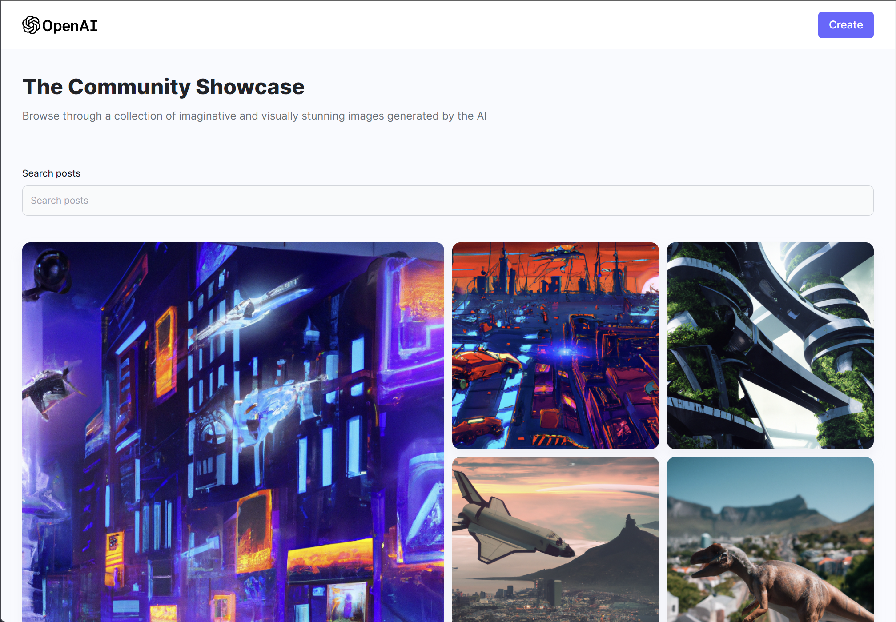

# AI Image Generation MERN Web App 

A web application that generate image based on given prompt.  
[Go to website](https://www.ai-image-gen.com)




## Built With 

- React.js, Node.js, Express.js, MongoDB, TailwindCSS, Vite
- OpenAI API, Cloudinary


## Install 

```
$ git clone https://github.com/bensonjing/ai-image.git 
$ cd ai-image
```


Client: 
```
$ cd client/ 
$ npm install 
$ npm run dev 
open browser and go to `http://localhost:5173`
```

Server: 
```
$ cd server/ 
$ npm install 
$ npm run start
open browser and go to `http://localhost:8080`
```
